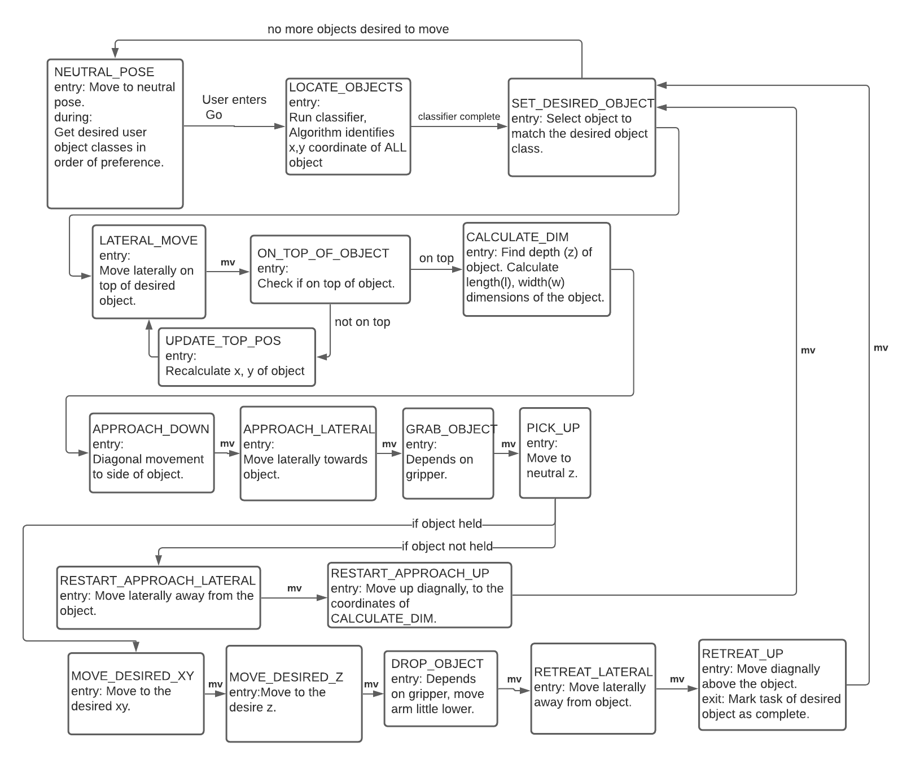
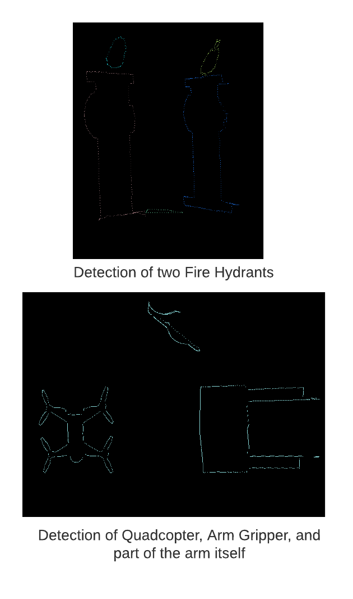
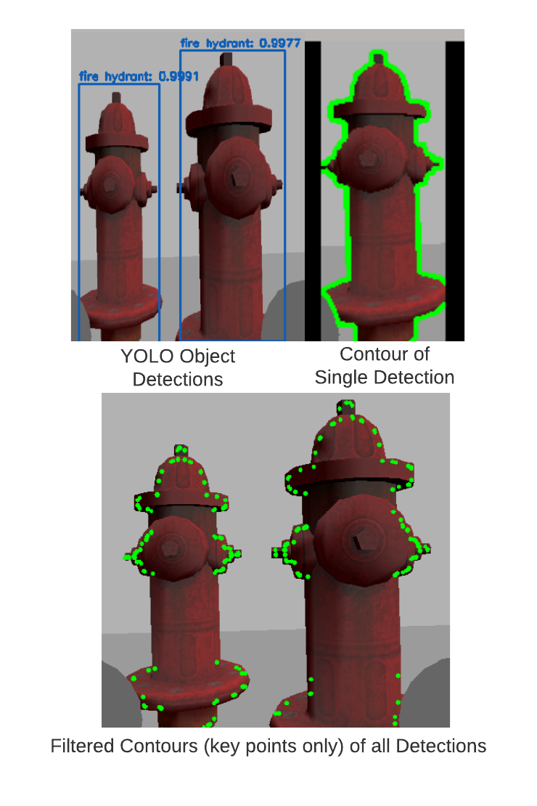

# Arm Project  
A ros package to control and simulate an autonomous robotic arm in picking and placing items.

## Simulation  
The robotic arm is a modified UR10 robotic arm  with a custom gripper and depth camera attachment. Simulations of the robot environment are done through Gazebo.

## Control  
A finite state machine was designed to create the control logic.  

The control was implemented using the Robot Operating System (ROS) in primarily Python, and some C++.  
Movement commands are sent through ros_control, and motion planning was done through the MoveIt API.  

## Perception  

### Object Shape and Coordinate Detection
From the depth camera attachment, point cloud data of the environment is obtained.  
Using the point cloud, the ground plane is removed and the remaining points are clustered via K-means clustering.  
Once clustered, a convex hull is constructed around each cluster, representing the objects.  
These clusters contain accurate coordinates of the objects in the field, but that class of the object is still unknown.

### Object Class Recognition
From the depth camera attachment, image data of the enviroment is obtained.  
YOLO v3 is used to classify each object. OpenCV is then used to produce contours around each object, from which the general location of the object is determined.  

### Processing the Object Class and Positional Data
The clusters from the point cloud and image are then paired together using Munkres
algorithm, with the Intersection over Union method used as the cost function.  
The result are clusters of each object with the respective positions and object class,  
both calculated with high accuracy.
