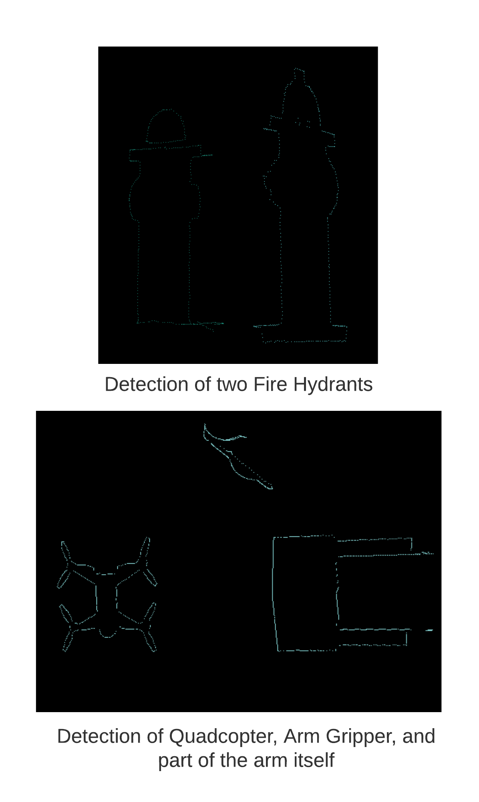

# Arm Project  
A ROS package to control and simulate an autonomous robotic arm in picking and placing items. Technologies used include OpenCV, ROS, Gazebo, YOLO, and Python.

## Simulation  
The robotic arm is a modified UR10 robotic arm  with a custom gripper and depth camera attachment. Simulations of the robot environment are done through Gazebo.

## Control  
A finite state machine was designed to create the control logic.  

The control was implemented using the Robot Operating System (ROS) in primarily Python, and some C++.  
Movement commands are sent through ros_control, and motion planning was done through the MoveIt API.  

## Perception  

### Object Shape and Coordinate Detection
From the depth camera attachment, point cloud data of the environment is obtained. The data is used to locate all possible objects in the field. The algorithm is as follows:
1. Using the point cloud, the points are downsampled and then the ground plane is removed.
2. The remaining points are clustered via K-means clustering.  
3. Once clustered, a 2D concave hull is constructed around each cluster, representing the objects.  
4. These clusters contain accurate coordinates of the objects in the field.

### Object Class Recognition
From the depth camera attachment, image data of the enviroment is obtained. The image data is used to identify all objects in the field, including determining the object classes and the general object coordinates. The algorithm is as follows:
1. YOLO v3 is used to classify each object in the field. 
2. OpenCV is then used to produce contours around each object.
3. For each object, determine the xy coordinates of each point in the respective contour.
4. Output the xy contours and class for each object that was detected.

### Processing the Object Class and Positional Data
The result of the point cloud and image modules is a series of clusters that contain different information. The point cloud clusters contain accurate coordinates of all suspected objects, and image clusters contain object classes and their respective coordinates (these coordinates are however inaccurate). 

The clusters from the point cloud and image are then paired together by relating their respective coordinates. Munkres algorithm is implemented, with the Intersection over Union method used as the cost function. The result are clusters of each object with the respective positions and object class, both calculated with high accuracy.
